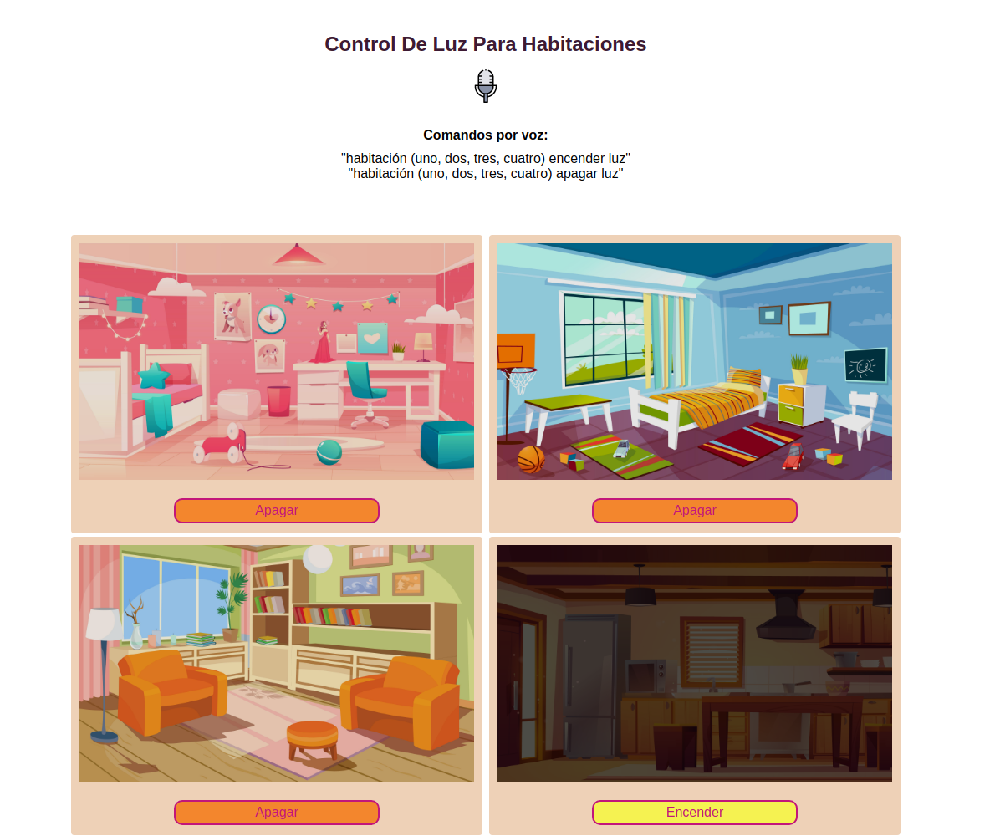
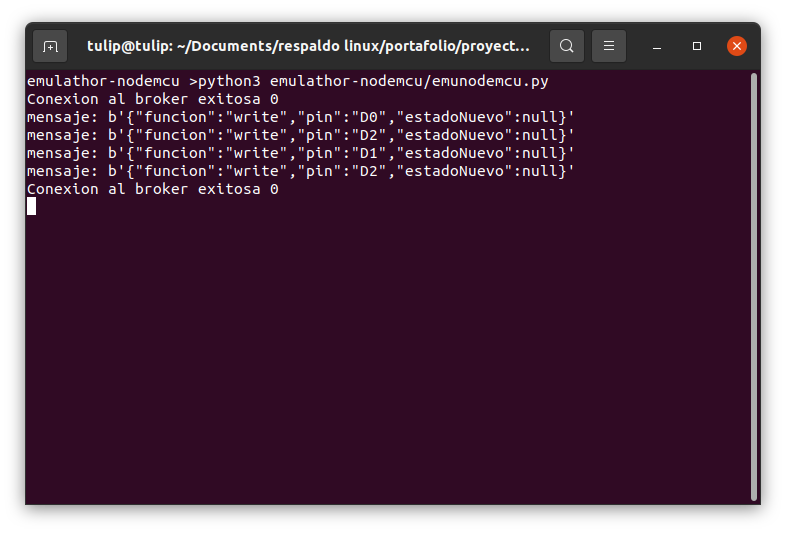

# IoT, Control board for the light in the room


## About The Project

Dashboard para controlar el encendido o apagado de luz en habitaciones de forma remota  
de forma manual o por comando de voz.

Control panel to remotely turn the room light on and off with a click or voice command

### Built with

* JavaScript
* MQTT
* JSON
* PYTHON
* CSS
* HTML


## Getting Started

### Prerequisites

1. Install Eclipse Paho MQTT Python3 https://pypi.org/project/paho-mqtt/
```sh 
pip3 install paho-mqtt 
```
2. Internet connection

### Installing

1. Clone the repo:
```sh
    git clone https://github.com/oscarbmo01/bar-chart-js-css-html-json.git``
```

2. Open the emunodemcu.py file
```sh
python3 emulathor-nodemcu/emonodemcu.py
```

3. Open the index.html file in a web browser

## Usage

Click the button to change the light state or click the microphone icon to use voice command.





## Licence

Distributed under the MIT License. See LICENSE for more information.